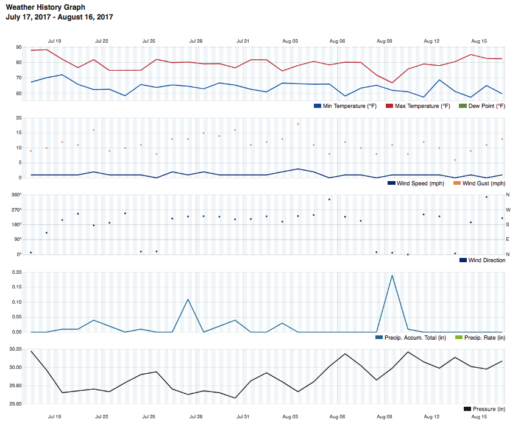

## Introduction

There are lots of ways to collect weather data with a Raspberry Pi. For example, you could:

- Collect humidity, temperature, and pressure data with a Sense HAT
- Connect environmental sensors to your GPIO pins and record measurements with some Python code.
- Build a complete [Weather Station](https://www.raspberrypi.org/education/weather-station/) like the kits we recently sent to lucky schools around the world.

Once you're collecting weather measurement, why not share your data with an online community like [Weather Underground](https://www.wunderground.com/)?

Weather Underground brings together a global community of people who uploaded weather and air quality data. This data is displayed on the Weather Underground website, and can be used by other people, for example for forecasting. Many types of popular consumer weather stations can be used with Weather Underground, and the code for the Oracle Raspberry Pi school kit can also be modified to stream data in this way.

--- collapse ---
---
title: Notes for Raspberry Pi Oracle Weather Station schools
---

If you are using one of our Oracle Weather Station kits, or have designed your own version, this guide assumes that you have already built and installed it. If you have not done that yet, follow [these instructions](https://www.raspberrypi.org/learning/weather-station-guide/), and then come back here when you've finished!

The steps in this guide assume that you will be continuously uploading data to Weather Underground. You can do this *and* continue to upload data to the Oracle database. If you have limited bandwidth or poor connectivity between your station and the internet, then you might want to consider a configuration that sends data every 15 minutes. The Weather Underground website will not display any data older than 20 minutes, so batch uploads of data are only really useful for historical storage. If you have one of out school Weather Station kits and frequent uploads cause problems, then you should probably stick to only using the Oracle database as described in the standard software build guide.

--- /collapse ---

### What you will make

You'll use the Python `requests` library to upload data from your weather sensors to the Weather Underground website, where you will be able to monitor and analyse your measurements.

You can then use the Weather Underground widgets to display a weather summary on your own website.

()

### What you will learn

This project covers elements from the following strands of the [Raspberry Pi Digital Making Curriculum](http://rpf.io/curriculum){:target="_blank"}:

+ [Apply programming constructs to solve a problem](https://curriculum.raspberrypi.org/programming/builder/){:target="_blank"}
+ [Combine inputs and/or outputs to create projects or solve a problem](https://www.raspberrypi.org/curriculum/physical-computing/builder){:target="_blank"}
