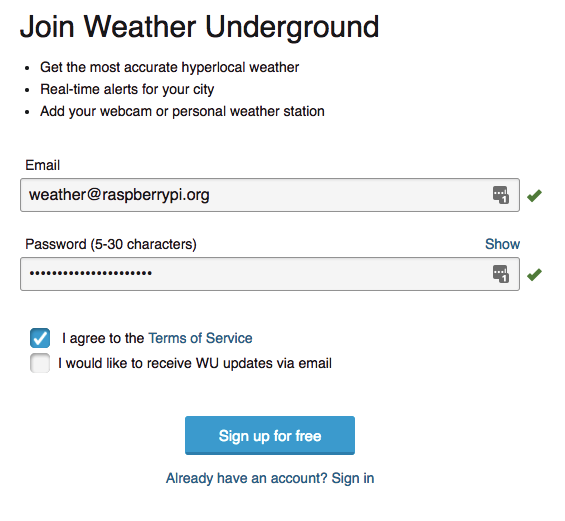

## Registering with Weather Underground

- You don't need to use a Pi for this step, so don't worry if you've installed a 'lite' version of Raspbian.  If you are using the Raspbian Desktop, we recommend that you install and use Firefox:

    ```bash
    sudo apt-get install firefox-esr
    ```

- To [register with Weather Underground](https://www.wunderground.com/signup){:target="_blank"},  you'll need to check the box to confirm that you agree with their terms of service, and provide an email address. If you're under 13 years old, you'll need to have an adult register on your behalf.  

- A  message will be sent to the email address that you provide, and you'll need to click on the **Validate your email** button that it contains. If you don't receive a validation email, check your Spam folder. If you still can't find it, you can request it again using the "Send Validation Email" button on the Add Weather Station page.



Now log in to your new Weather Underground account and follow the steps below to add your weather station
- Select that option from the **More** drop-down menu at the top of the page.
- Then use the map to set the location of your weather station.
- Zoom in on the map and try to place the marker as accurately as possible. You can also set your height above sea level, which you can find using one of a number of [online tools](https://www.freemaptools.com/elevation-finder.htm){:target="_blank"}.
- Click on the "Verify Location" button to move on to the next page.
- Provide a general description of your location in the "Neighbourhood" box. This will appear with your station details on the website, so choose something useful.
- Select what kind of Hardware you have: make sure you select the option 'Raspberry Pi".
- All other parameters are optional but you can complete them if you wish.
- When you've finished completing the details on this page, click the 'Submit' button at the bottom.

Weather Underground will then display a station ID and password. Make a note of these credentials, as you'll need them when writing the upload code.
