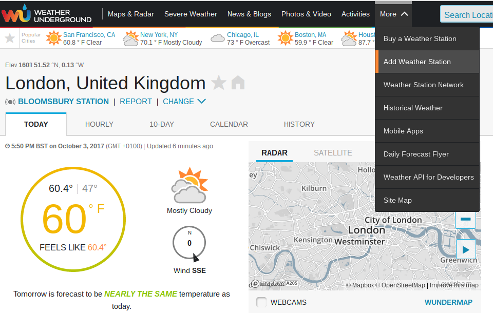
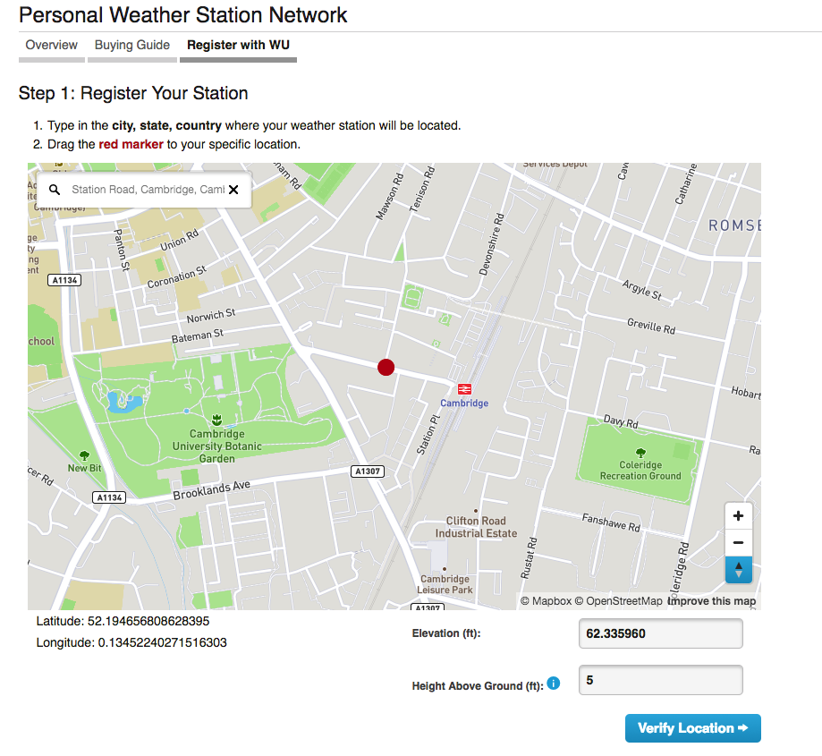

## Registering with Weather Underground

You can register with Weather Underground via their website. You don't need to use a Pi for this step, so don't worry if you've installed a 'lite' version of Raspbian.  If you are using the Raspbian desktop, we recommend that you install and use the Firefox browser:

```bash
sudo apt-get install firefox-esr

```

To display your weather data, you will need to register for an account on Weather Underground.

- Visit the [Weather Underground registration page ](https://www.wunderground.com/signup){:target="_blank"}. Supply an email address and choose a password. You'll need to check the box to confirm that you agree with their terms of service.  If you're under 13 years old, you'll need to have an adult register on your behalf.  Click **Sign up for free** when you're ready.

- A  message will be sent to the email address that you've provided, and you'll need to click the **Validate your email** button that it contains. If you don't receive a validation email, check your spam folder. If you still can't find it, you can request it again using the **Send Validation Email** button on the **Add Weather Station** page. If you find that you are continually being asked to validate your account even after having followed the emailed link, you should clear your browser cookies.


Once you have a Weather Underground account, add your weather station details.

- Log in to your new Weather Underground account.
- Select **Add Weather Station** from the **More** drop-down menu at the top of the page.



- Then use the map to set the location of your weather station. Zoom in on the map and try to place the marker as accurately as possible.



- You can also set your height above sea level, which you can find using one of a number of [online tools](https://www.freemaptools.com/elevation-finder.htm){:target="_blank"}.
- Click on the **Verify Location** button to move on to the next page.
- Provide a general description of your location in the **Neighbourhood** box. This will appear with your station details on the website, so choose something useful.
- Select what kind of hardware you have: make sure you select the option **Raspberry Pi**.
- All other parameters are optional — you can complete them if you wish.
- When you've finished, click the **Submit** button at the bottom.

Weather Underground will then display a station ID and password. Make a note of these credentials, as you'll need them when you're writing the upload code.
