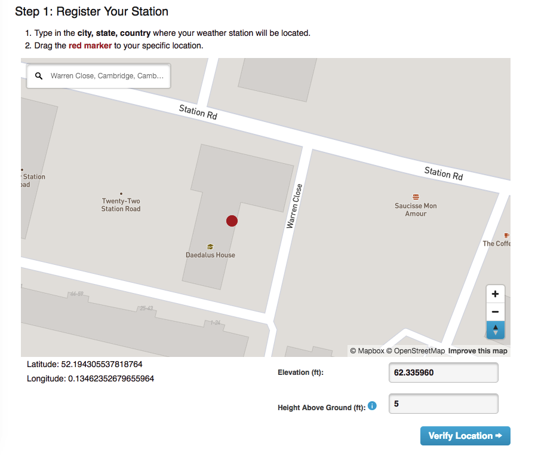

## Registering with Weather Underground

- First, [register with Weather Underground](https://www.wunderground.com/signup). You'll need to check the box to confirm that you agree with their terms of service, and provide an email address. A  message will be sent to that account, and you'll need to click on the **Validate your email** button that it contains.

Now log in to your new Weather Underground account and add your weather station
- Select that option from the **More** drop-down menu at the top of the page. Then use the map to set the location of your weather station. Zoom in on the map and try to place the marker as accurately as possible. You can also set your height above sea level, which you can find using one of a number of [online tools](https://www.freemaptools.com/elevation-finder.htm).

- On the next page, give a general description of your location. This will appear with your station details on the website, so choose something useful. You also need to say what kind of weather station you have: Raspberry Pi is not one of the options, so just select **other**. Then click **submit**.

Weather Underground will then display a station ID and password. Make a note of these credentials, as you'll need them when writing the upload code.
