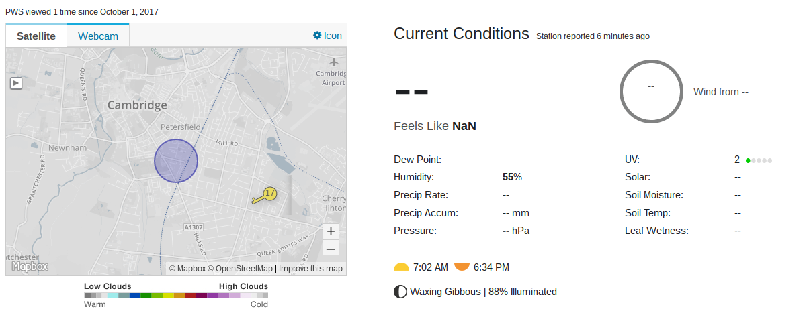

## Using Python to upload your data

One of the great things about Python is the huge number of libraries that people have written and made available for free. Here you're going to use the `requests` library, so make sure you've installed it.

[[[generic-python-requests]]]

- Now that you can make HTTP requests using Python, let's construct the code to send your data to Weather Underground. First of all, import the Requests library. Add this line to the top of `WU-upload.py`.

    ```python
    import requests
    ```

- Now you need to develop the code to process each one of your weather readings. Rather than use actual measurements from your sensors during this development stage, create some test data as Python variables. Add these lines underneath your library imports. If you have an Oracle Weather Station, you should have:

   ```python
   humidity = 55.998
   ambient_temp = 23.456
   pressure = 1067.890
   ground_temp = 16.345
   wind_speed = 5.6129
   wind_gust = 12.9030
   wind_average = 180
   rainfall = 1.270
   ```


 - Then add some variables to hold each part of the URL:

    ```python
    # create a string to hold the first part of the URL
    WUurl = "https://weatherstation.wunderground.com/weatherstation
    \/updateweatherstation.php?"
    WU_station_id = "XXXX" # Modify this variable so that in contains your PWS Id
    WU_station_pwd = "YYYY" # Modify this variable so that in contains your Password
    WUcreds = "ID=" + WU_station_id + "&PASSWORD="+ WU_station_pwd
    date_str = "&dateutc=now"
    action_str = "&action=updateraw"

    ```
    --- collapse ---
    ---
    title: Notes for Raspberry Pi Oracle Weather Station schools
    ---
    Note that you don't need to create a string for the time stamp of each reading. Weather Underground will create this value based on when it received the data if you use the parameter value 'now' in your HTTP request. If you want to store weather readings and uploading them in bulk later, perhaps at the same time as you upload to the Oracle database,  you would need to format a time stamp for each record before sending it.

    ---/collapse ---

    Don't forget to replace ```XXXX``` and ```YYYY``` with your Weather Underground PWS ID and password.  If you can't find where you noted down the Personal Weather Station (PWS) credentials which Weather Underground issued you, you can always look them up [here](https://www.wunderground.com/personal-weather-station/mypws){:target="_blank"}.

- Start with a single measurement to check the process. For example, your humidity readings.

 - Unless you're using very expensive sensors, the readings probably won't be accurate to more than a couple of decimal places so you can also round them appropriately. This will make the final URL much easier to read, which will help if you need to do any debugging. It is also good practice to present data that does not claim to be more accurate than it really is.

[[[rounding-numbers-with-python]]]

- So for your humidity measurements:

    ```python
    humidity_str = "{0:.2f}".format(humidity)
    ```

 - Now, at the bottom of the file, build the complete HTTP request, including your humidity value.

    ```python
    r= requests.get(
        WUurl +
        WUcreds +
        date_str +
        "&humidity=" + humidity_str +
        action_str)
    ```

 - If your upload fails for some reason, you may be able to get some useful debugging information from the status code that will be sent back by the Weather Underground server. Add a line to print this out (this should not be indented).

    ```python
    print("Received " + str(r.status_code) + " " + str(r.text))
    ```

- Test your work. Run the Python code (Press F5 if you're using Idle). If your upload completes without any errors you should see the message `Received 200 success`. Now head over to your Weather Underground PWS page and verify that the data was indeed uploaded and is now being displayed.

    

- Now repeat the process above for each of your sensors. You may need to use the code you've already written to perform any required conversion.

- To get started, write the code to take your atmospheric pressure reading, convert it from pascals to inches of mercury, and then turn it into a string called `pressure_in` rounded to two decimal places.

--- hints ---
--- hint ---
You can use the function you wrote earlier to perform the unit conversion.
```python
pressure = hpa_to_inches(pressure_in_hpa)
```
--- /hint ---
--- hint ---
Now use `.format` to create the rounded string:
```python
pressure_str = "{0:.2f}".format(pa_to_inches(pressure))
```
---/hint---
--- hint ---
Then add this value to the HTTP GET request:
```python
r= requests.get(
    WUurl +
    WUcreds +
    date_str +
    "&humidity=" + humidity_str +
    "&baromin=" + pressure_str +
    action_str)
```
---/hint---
---/hints---

- You can use the same process for all of your other weather readings. If you have an Oracle Weather Station kit, that will produce measurements for ambient & ground temperature, humidity, wind speed, wind direction and gusts, and rainfall. Some of these values will need to be converted into the appropriate units, others just need to be rounded.

--- hints ---
--- hint ---
Use the functions that you wrote earlier to perform the conversions.
--- /hint ---
--- hint ---
Then use *.format* to perform the rounding.
```python
rounded_number = "{0:.2f}".format(number_with_dec_places)
```
--- /hint---
--- hint ---
- Your code should look like this:
```python
ambient_temp_str = "{0:.2f}".format(degc_to_degf(ambient_temp))
ground_temp_str = "{0:.2f}".format(degc_to_degf(ground_temp))
humidity_str = "{0:.2f}".format(humidity)
pressure_in_str = "{0:.2f}".format(pa_to_inches(pressure))
wind_speed_mph_str = "{0:.2f}".format(khm_to_mph(wind_speed))
wind_gust_mph_str = "{0:.2f}".format(khm_to_mph(wind_gust))
wind_average_str = str(wind_average)
rainfall_in_str = "{0:.2f}".format(mm_to_inches(rainfall))
```
---/hint---
---/hints---

Finally, put together the whole URL by combining the data measurements with the other variables needed for the complete Weather Underground upload request.  

--- hints ---
--- hint ---
The complete URL will need the server address, the Weather Underground credentials, the timestamp and the action parameters.
--- /hint ---
--- hint ---
These are stored in the variables: WUurl, WUcreds, date_str and action_str. Strings can be joined together using the **+** operator.
--- /hint ---
--- hint ---
Your code should look like this:
```python
r= requests.get(
    WUurl +
    WUcreds +
    date_str +
    "&humidity=" + humidity_str +
    "&baromin=" + pressure_str +
    "&windspeedmph=" + wind_speed_mph_str +
    "&windgustmph=" + wind_gust_mph_str +
    "&tempf=" + ambient_temp_str +
    "&rainin=" + rainfall_in_str +
    "&soiltempf=" + ground_temp_str +
    "&winddir=" + wind_average_str +
    action_str)
```
    ---/hint---
    ---/hints---
