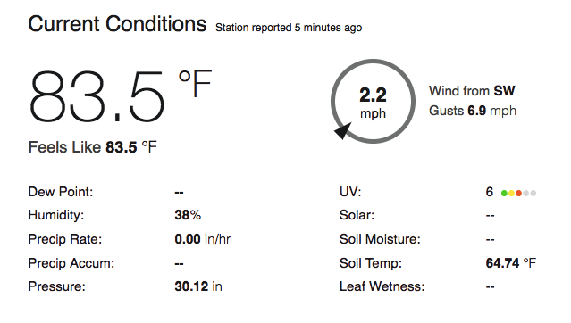

## Using live data

- For testing and development, you used some fictitious data values, stored as variables in your code. Once you've tested your upload, you should delete these and use the code to process real data from your weather station.



- To perform regular uploads you could have a one-shot script that is run at set intervals using Crontab

[[[nix-bash-crontab]]]

--- hints ---
--- hint ---
If you get stuck, here is a basic example of a [simple data uploader based on the Sense Hat](resources/WU-sensehat-live.py) script.

--- /hint ---
--- hint ---
Make your Python file executable:
    ```
    chmod +x /home/pi/WU-sensehat-live.py
    ```

--- /hint ---
--- hint ---
Then add the following line to your crontab file:
    ```
    */5 * * * * /home/pi/WU-sensehat-live.py
    ```
--- /hint ---
--- /hints ---

- Alternatively, you could wrap your measuring and upload code in a loop and pause between iterations.

[[[generic-python-while-true]]]

--- hints ---
--- hint ---
You may need to re-arrange your code somewhat so that only the lines which deal with measurement and upload are inside the loop. All  string definitions that do not change for each reading should be outside of the loop.
--- /hint ---
--- hint ---
If you get stuck, here is a basic example of a [simple data uploader based on the Sense Hat](resources/WU-sensehat-live-loop.py) script.

--- /hint ---

--- /hints ---

--- collapse ---
---
title: Notes for Raspberry Pi Oracle Weather Station schools
---

The Oracle Weather Station software uses the Crontab method to run a Python script called [log_all_sensors.py](https://github.com/raspberrypi/weather-station/blob/master/log_all_sensors.py) every 5 minutes. A simple way to modify your Weather Station so that it regularly uploads data to Weather Underground is to add the upload code you have written to this file.

If you've followed the [standard installation instructions](https://www.raspberrypi.org/learning/weather-station-guide/), this script should be run every five minutes via Cron, which is a sensible frequency for uploading to a site like Weather Underground.

--- hints ---
--- hint ---
If you get stuck, here is a basic example of a [modified log_all_sensors.py](resources/log_all_sensorsWU.py) script.

--- /hint ---
--- /hints ---

--- /collapse ---
